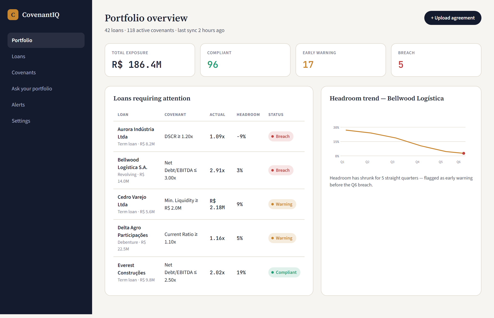
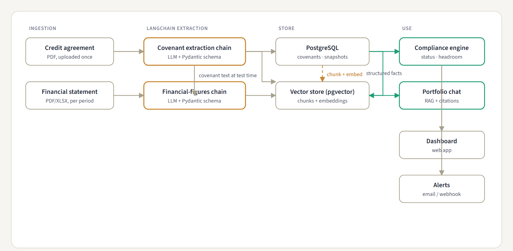

<div align="center">

# CovenantIQ

**AI-powered covenant compliance & credit portfolio intelligence.**
Reads loan and credit agreements with an LLM, tracks financial covenants against borrower statements over time, and answers portfolio questions in natural language — grounded in the original documents.

[](#roadmap)
[](#tech-stack)
[](#the-extraction-pipeline)
[](#license)

[Whitepaper (PDF)](docs/whitepaper.pdf) · [Architecture](#architecture) · [Roadmap](#roadmap)

</div>

> **Portfolio project, synthetic data only.** Every figure, borrower name, and document referenced in this repository is generated for demonstration purposes. CovenantIQ is not affiliated with, and does not process data from, any real financial institution, lender, or client.



---

## The problem

Every credit agreement a lender signs — a term loan, a debenture, a revolving facility — comes with **financial covenants**: contractual thresholds the borrower must keep meeting, like a maximum Net Debt / EBITDA ratio, a minimum liquidity balance, or a minimum debt-service coverage ratio.

In most credit funds and bank portfolios, checking these covenants is still manual: an analyst re-reads the agreement to recall the exact definition and threshold, then cross-references it against whatever financial statement the borrower sent that quarter. Across a portfolio of fifty or a hundred loans, this doesn't scale — and it means breaches are often caught **after** the fact, instead of as a trend the moment a borrower's headroom starts shrinking.

CovenantIQ is a proof-of-concept for the other approach: read the legal document once with an LLM to get a structured, queryable definition of every covenant, then feed financial data into that structure continuously so breaches — and early warning signs — surface automatically.

## What it does

| | |
|---|---|
| **Extract** | Upload a credit agreement PDF. A LangChain extraction chain pulls parties, principal, rate, maturity, and every financial covenant as a structured, typed definition (metric, operator, threshold, test frequency, cure period). |
| **Monitor** | Each time a borrower's financial statement comes in, a second extraction pass pulls the line items each covenant needs, computes the actual ratio, and stores a dated compliance snapshot — not just pass/fail, but how much headroom is left. |
| **Visualize** | A dashboard rolls every loan's covenant status into one portfolio view: what's compliant, what's in warning range, what's breached, and whose headroom has been shrinking quarter over quarter. |
| **Ask** | A retrieval-augmented chat answers questions like *"which loans have a leverage covenant with less than 10% headroom?"* — grounded in the actual agreement text, with a citation back to the source page. |

## Architecture

Two ingestion paths feed the same store: the agreement (read once, rarely changes) and the financial statements (read every reporting period). The compliance engine and the portfolio chat both read from that store.



## The extraction pipeline

The hardest part of this project isn't calling an LLM — it's getting a covenant definition out of dense legal prose as something a program can actually test later.

**Structured output, not free text.** Every extraction call uses LangChain's `with_structured_output()` bound to a Pydantic model, so the response is validated against a schema before it ever reaches the database — a malformed covenant (missing threshold, ambiguous operator) fails loudly at extraction time, not three months later when the engine tries to test it.

```python
class Covenant(BaseModel):
    name: str
    metric: Literal["net_debt_ebitda", "dscr", "min_liquidity", "min_equity", "current_ratio"]
    operator: Literal["lte", "gte"]
    threshold: float
    test_frequency: Literal["quarterly", "annual"]
    cure_period_days: int | None
    source_clause: str          # verbatim clause, for audit + citations
    source_page: int

extraction_chain = prompt_template | llm.with_structured_output(CovenantExtractionResult)
result = extraction_chain.invoke({"document_text": agreement_text})
```

Every extracted covenant carries a `source_page` and the verbatim clause it came from — the same anchor the chat's citations use later (see the [whitepaper](docs/whitepaper.pdf), §4 and §7, for the full extraction and retrieval design).

## Tech stack

| Layer | Choice |
|---|---|
| API | FastAPI |
| LLM orchestration | LangChain (structured-output extraction chains, RAG retrieval chain) |
| Database | PostgreSQL + pgvector — one store for structured covenant data and embeddings |
| Background jobs | Celery + Redis |
| Frontend | React + TypeScript |
| Deployment | Docker Compose |

## Repository structure

```
covenant-iq/
├── api/                    FastAPI app — routes, auth, schemas
│   ├── extraction/         LangChain chains (agreement + financials)
│   ├── engine/             compliance engine (config-driven rules)
│   ├── chat/               RAG retrieval chain
│   └── models/             SQLAlchemy models
├── worker/                 Celery tasks (async extraction, re-scoring)
├── web/                    React + TypeScript dashboard
├── data/synthetic/         generated demo loans, agreements, statements
├── docs/
│   ├── whitepaper.pdf       full technical whitepaper
│   ├── architecture.png
│   └── dashboard.png
├── docker-compose.yml
└── README.md
```

## Roadmap

- [ ] **v0.1 — Core pipeline:** agreement upload → covenant extraction → manual review → compliance engine → dashboard. Synthetic data only.
- [ ] **v0.2 — Chat:** RAG retrieval chain over the extracted portfolio, with citations.
- [ ] **v0.3 — Alerting:** configurable early-warning thresholds, email/webhook delivery.
- [ ] **v0.4 — Multi-document agreements:** amendments and side letters that modify an original covenant.
- [ ] **Stretch:** extraction confidence scoring, so the human-review queue prioritizes the extractions most likely to be wrong.

Full design detail — data model, security & governance considerations, and the reasoning behind each decision — is in the [technical whitepaper](docs/whitepaper.pdf).

## License

MIT — see [`LICENSE`](LICENSE).

---

<div align="center">
<sub>Built as a portfolio project to demonstrate applied LLM/LangChain engineering for financial-services document intelligence. Synthetic data only.</sub>
</div>
